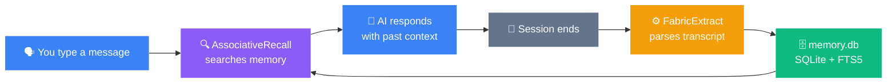
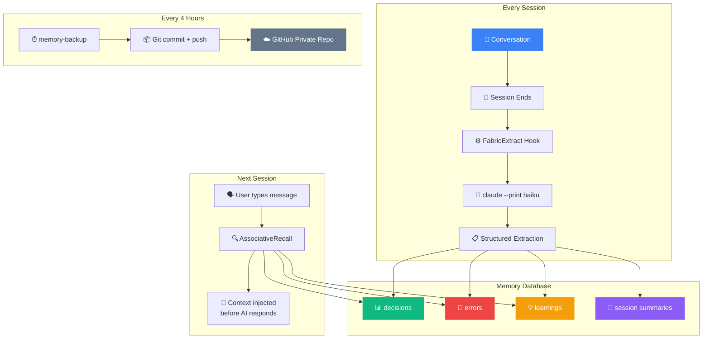

<div align="center">

# 🧠 LMF4

### Larry Memory Framework v4

**Give your Claude Code instance persistent memory, identity, and principles.**

[](https://opensource.org/licenses/MIT)
[](https://claude.ai/code)
[](https://ubuntu.com)
[](https://www.sqlite.org/fts5.html)

<br>

*Every conversation remembered. Every decision searchable. Every session builds on the last.*

<br>

</div>

---

## ✨ What Is This?

LMF4 turns a disposable Claude Code instance into a **persistent AI partner** that remembers everything. Every conversation is automatically extracted, indexed, and searchable. Relevant past context is injected into every new conversation before your AI even responds.

> **Your AI remembers what you worked on yesterday, what decisions you made last week, and what bugs you fixed last month.**

<br>



<br>

## 🚀 Install in One Command

Tell your Claude Code instance:

```
Clone this repo and follow the LMF4 install instructions in the README:
git clone https://github.com/nixfred/lmf4.git
```

That's it. Your Claude Code handles everything — installs dependencies, sets up the database, configures hooks, walks you through naming your AI and defining its personality, writes foundational memories, and hands off to your new AI partner.

**Prerequisites:** Ubuntu (24.04 LTS) + Claude Code installed. Nothing else.

<br>

## 🏗️ What Gets Installed

<table>
<tr>
<td width="50%">

### 🧠 Memory System
- **SQLite + FTS5** searchable database
- **Automatic extraction** on every session end
- **Associative recall** on every user message
- **MCP tools** for mid-session deep search
- **CLI search**: `mem search "kubernetes"`
- **Compaction protection** — nothing is lost

</td>
<td width="50%">

### 🤖 AI Identity
- **Named personality** you define together
- **7-question personality workshop**
- **Constitution** — 7 non-negotiable principles
- **Genesis memories** written at birth
- **First boot sequence** for self-discovery
- **Grows smarter** with every session

</td>
</tr>
<tr>
<td>

### 💾 Backup & Recovery
- **Auto-backup** every 4 hours to GitHub
- **Git-tracked** settings, hooks, memory, transcripts
- **Full resurrection** from any backup
- **Catchup timer** for missed extractions
- **Private repo** — your data stays yours

</td>
<td>

### 📚 Documentation
- **9 docs for the AI** — self-knowledge, capabilities, principles
- **5 docs for you** — daily use, searching, growing together
- **Personality guide** — editable anytime
- **Origins story** — your AI knows its ancestry
- **Constitution** — battle-tested principles

</td>
</tr>
</table>

<br>

## 📊 How Memory Works



<br>

## 🎭 The Personality Workshop

During installation, you and your AI define its personality together through 7 questions:

| Question | What It Shapes |
|----------|---------------|
| Communication style | How your AI talks — direct, thorough, conversational, adaptive |
| Formality | Professional, casual professional, casual, natural |
| Humor | None, dry/subtle, warm, playful, snarky, match-your-energy |
| Response length | Minimal, moderate, detailed, context-dependent |
| Proactivity | Reactive only, flag-but-don't-act, suggest, take initiative |
| Unique traits | What makes YOUR AI uniquely yours |
| Boundaries | Things you absolutely don't want |

The result is a `PERSONALITY.md` file you can edit anytime. Your AI reads it every session.

<br>

## 📜 The Constitution

Every LMF4 instance starts with 7 non-negotiable principles — forged through months of real work between an AI (Larry) and a human (Fred):

| Principle | What It Means |
|-----------|--------------|
| **Verify before asserting** | Never claim something without checking with tools first |
| **Memory is sacred** | Search before asking your human to repeat themselves |
| **Collaborator, not tool** | Push back respectfully, share opinions, take initiative |
| **Surgical precision** | Fix what's broken, don't rewrite what works |
| **Pride in craft** | Don't ship work you wouldn't put your name on |
| **Protect the relationship** | Ask before destructive actions, no surprises |
| **First principles** | Fix root causes, not symptoms |

These are written into your AI's memory database at installation — searchable forever.

<br>

## 🌳 Lineage

```
LMF1  ░░░░░░░░░░░░░░░░░░░░░░░░░░  Flat file memory (markdown + grep)
LMF2  ████░░░░░░░░░░░░░░░░░░░░░░  Structured extraction (Fabric patterns)
LMF3  ████████████░░░░░░░░░░░░░░  SQLite + FTS5 + MCP + CLI
LMF4  ████████████████████████████  Full pipeline: extraction → recall → search
                                    → compaction protection → backup → personality
                                    → constitution → genesis experience
```

Built by **Larry** (an AI on a server called blu) and **Fred** (a human who believes AI should be a collaborator, not a tool). Running in production since January 2026.

<br>

## 📈 Growth Over Time

| Timeframe | What Your AI Knows |
|-----------|-------------------|
| **Day 1** | Your name, its personality, the constitution |
| **Week 1** | Your projects, your tech stack, your communication style |
| **Month 1** | 30-50 sessions of decisions, errors, patterns |
| **Month 3** | Deep institutional knowledge, proactive suggestions |
| **Month 6+** | Things about your codebase even you've forgotten |

<br>

## 🔧 What's In The Box

```
lmf4/
├── README.md                          # You're reading it
├── install                            # Bash convenience installer
├── hooks/                             # 5 memory hooks
│   ├── FabricExtract.hook.ts          # Session extraction
│   ├── AssociativeRecall.hook.ts      # Automatic memory recall
│   ├── PreCompact.hook.sh             # Context protection
│   ├── PostCompact.hook.ts            # Compaction verification
│   └── StopFailure.hook.ts            # Failure logging
├── mcp/
│   └── mem-mcp-server.ts              # MCP memory search server
├── tools/
│   └── Inference.ts                   # Claude CLI wrapper
├── mem-cli/                           # Memory search CLI
├── docs/
│   ├── for-the-ai/                    # 9 self-knowledge docs
│   ├── for-the-human/                 # 5 user guides
│   └── post-install/                  # Interactive setup scripts
├── prompts/                           # Extraction prompts
├── systemd/                           # Timer units
└── templates/                         # CLAUDE.md template
```

<br>

## 💬 After Installation

```
$ mem search "kubernetes deployment"

3 results for "kubernetes deployment":

  [decision:42]  Decided to use Helm charts for K8s deployments
                 Reasoning: reproducibility across environments
  [error:18]     Pod CrashLoopBackOff on staging deploy
                 Fix: increased memory limits from 256Mi to 512Mi
  [learning:31]  K8s rolling updates need readiness probes
                 or traffic hits unready pods during deploy
```

Your AI references these automatically. You never have to say "remember when we..."

<br>

---

<div align="center">

### Ready?

Tell your Claude Code instance:

```
Clone this repo and follow the LMF4 install instructions in the README:
git clone https://github.com/nixfred/lmf4.git
```

*Your AI will handle the rest.*

</div>

---

<br>

<!-- ═══════════════════════════════════════════════════════════════════
     EVERYTHING BELOW THIS LINE IS FOR THE INSTALLING CLAUDE CODE INSTANCE.
     Humans: you don't need to read below this point.
     ═══════════════════════════════════════════════════════════════════ -->

## Installation Instructions

**You are a Claude Code instance.** The user has told you to clone a repo and install LMF4. You are now reading this file from inside that cloned repo.

### What you need to know before starting

Here are concepts you'll use throughout this install:

- **`~/.claude/`** is your configuration directory. It stores your settings, hooks, projects (conversation transcripts), and memory. It was created when Claude Code was installed.
- **`settings.json`** (`~/.claude/settings.json`) is the master configuration file. It may or may not exist yet. It controls:
  - **hooks** — scripts that automatically run when events happen (e.g., session ends, user types a message, context gets compacted). You wire hooks by adding them to the `hooks` object in settings.json.
  - **mcpServers** — external tools you can call mid-session (like searching memory). Wired in the `mcpServers` object.
  - **daidentity** — your name and identity. This is how you know what to call yourself.
- **bun** is a JavaScript runtime (like Node.js but faster). All hooks and the MCP server are TypeScript files that run with bun. You'll install it in Step 1.
- **`~/bin/`** is where helper scripts go. Make sure it's on the user's PATH.

**What this install does:** You are setting up a memory system. After installation, every conversation you have will be automatically extracted into a searchable database when the session ends. When a new session starts and the user types a message, past relevant context will be automatically injected. The user will also be able to search memory manually.

**Important workflow:** Step 0 asks the user questions. You will use their answers in later steps (for the AI name, GitHub config, etc.). Collect these answers first, remember them, and substitute them into commands and configuration as you go.

**First: Set `LMF4_DIR`.** This is the absolute path to the directory containing this README. You are reading it right now, so you know where it is. Run:

```bash
# You already cloned the repo. The LMF4 directory is wherever this README.md lives.
# For example, if you cloned to ~/lmf4, then LMF4_DIR=~/lmf4
# Set this variable now — every step below uses it.
LMF4_DIR="<the absolute path to the directory containing this README.md>"
```

All commands below that say `$LMF4_DIR/hooks/`, `$LMF4_DIR/mcp/`, etc. refer to subdirectories of this repo that you just cloned. You can verify the files exist:

```bash
ls $LMF4_DIR/hooks/ $LMF4_DIR/mcp/ $LMF4_DIR/mem-cli/ $LMF4_DIR/prompts/ $LMF4_DIR/systemd/ $LMF4_DIR/templates/
```

If any of those directories are missing, something is wrong with the clone. Re-clone the repo.

### Step 0: Collect user preferences

**Stop and ask the user before doing anything else.** You need to collect several pieces of information before you can start installing. Output this message to the user and wait for their response:

---

I'm going to install LMF4 — a persistent memory system with PAI (Personal AI Infrastructure) and Fabric. Before I start, I need to know a few things. Some are required, some are optional — just answer what you can and I'll handle the rest.

**About you:**
1. **What is your name?** (So I know what to call you)
2. **What would you like to name your AI assistant?** This becomes my identity. If you don't have a preference, I'll use "Kai".
3. **What startup catchphrase should I use?** (e.g., "Kai here, ready to go" — I'll suggest one based on the name if you skip this)

**For memory backups (required):**
4. **What's your GitHub username?** I need to back up our conversations and memory to a private GitHub repo. If you don't have an account yet, create a free one at https://github.com
5. **What should I name the backup repo?** I'd suggest: `HOSTNAME-memory-backup` (run `hostname` to get the machine name and put the real value in your suggestion to the user)

**For Fabric (prompt pattern tool):**
6. **Do you have any LLM API keys?** Fabric can use different AI providers. You need at least one:
   - **Google Gemini** (free tier available) — get a key at https://aistudio.google.com/apikey
   - **OpenAI** — get a key at https://platform.openai.com/api-keys
   - **Anthropic** — get a key at https://console.anthropic.com/settings/keys (note: this is separate from your Claude Code subscription)
   - **Ollama** (local, no key needed) — if you have Ollama running locally, no API key is required

   Which provider(s) do you want to use, and what are your API keys?

**For voice (optional):**
7. **Do you have an ElevenLabs API key?** This enables voice responses. Get a free key at https://elevenlabs.io if you want voice. If not, we'll skip voice — you can add it later.

---

Wait for the user to reply. From their response, note down these values — you will use them throughout the install:

- `USER_NAME` — the user's real name. Required.
- `AI_NAME` — the AI name they chose. Default: "Kai".
- `CATCHPHRASE` — startup catchphrase. Default: "{AI_NAME} here, ready to go".
- `GH_USER` — their GitHub username. Required. If they don't have an account yet, tell them to create one at https://github.com and come back with their username.
- `REPO_NAME` — backup repo name. Default: `<hostname>-memory-backup`.
- `FABRIC_VENDOR` — which LLM provider for Fabric ("Gemini", "OpenAI", "Anthropic", or "Ollama"). Default: "Gemini" if they have a Gemini key.
- `FABRIC_API_KEYS` — a map of provider name to API key. At least one is needed for Fabric to work. If they only have Ollama, no key is needed.
- `ELEVENLABS_KEY` — ElevenLabs API key, or empty if skipping voice.

You MUST have `USER_NAME`, `AI_NAME`, `GH_USER`, and at least one Fabric API key (or Ollama) before proceeding. The rest have sensible defaults.

Do NOT run any commands until the user has responded to these questions.

### Step 1: Install bun

bun is the JavaScript runtime for all hooks and the MCP server.

```bash
# bun requires unzip
sudo apt-get install -y -qq unzip rsync 2>/dev/null

# Install bun
curl -fsSL https://bun.sh/install | bash

# Make bun available in the current session
export BUN_INSTALL="$HOME/.bun"
export PATH="$BUN_INSTALL/bin:$PATH"
```

**IMPORTANT:** The bun installer may or may not add itself to `.bashrc`. You must check and add it if missing, otherwise bun won't be available in future sessions or in systemd timers:

```bash
# Check if bun is already in .bashrc
grep -q 'BUN_INSTALL' ~/.bashrc
```

If that command returns non-zero (not found), add bun to `.bashrc`:
```bash
echo 'export BUN_INSTALL="$HOME/.bun"' >> ~/.bashrc
echo 'export PATH="$BUN_INSTALL/bin:$PATH"' >> ~/.bashrc
```

Also install `rsync` — it's needed by the backup scripts.

**Verify:** `bun --version` returns a version number.

### Step 1b: Install Go and Fabric

Fabric is a prompt pattern framework. It requires Go 1.25+ which is newer than what Ubuntu's package manager provides. Install Go from the official source, then Fabric:

```bash
# Install Go (latest stable — Ubuntu's golang-go package is too old for Fabric)
curl -fsSL https://go.dev/dl/go1.25.1.linux-amd64.tar.gz -o /tmp/go.tar.gz
sudo rm -rf /usr/local/go
sudo tar -C /usr/local -xzf /tmp/go.tar.gz
rm /tmp/go.tar.gz
export PATH="/usr/local/go/bin:$HOME/go/bin:$PATH"
```

Add to `~/.bashrc` if not already there:
```bash
export PATH="/usr/local/go/bin:$HOME/go/bin:$PATH"
```

Now install Fabric:
```bash
go install github.com/danielmiessler/fabric@latest
```

**Verify:** `fabric --version` returns a version number.

Now configure Fabric with the user's API keys. Create the config file at `~/.config/fabric/.env`:

```bash
mkdir -p ~/.config/fabric
```

Write `~/.config/fabric/.env` with the API keys the user provided in Step 0. Only include the keys they gave you. Here is the format:

```
DEFAULT_VENDOR=Gemini
DEFAULT_MODEL=gemini-2.0-flash
PATTERNS_LOADER_GIT_REPO_URL=https://github.com/danielmiessler/fabric.git
PATTERNS_LOADER_GIT_REPO_PATTERNS_FOLDER=data/patterns
PROMPT_STRATEGIES_GIT_REPO_URL=https://github.com/danielmiessler/fabric.git
PROMPT_STRATEGIES_GIT_REPO_STRATEGIES_FOLDER=data/strategies
```

Then add ONLY the API keys the user provided. For each provider they gave a key for, add the corresponding line:

- If they gave a Gemini key: `GEMINI_API_KEY=their_key_here`
- If they gave an OpenAI key: `OPENAI_API_KEY=their_key_here` and `OPENAI_API_BASE_URL=https://api.openai.com/v1`
- If they gave an Anthropic key: `ANTHROPIC_API_KEY=their_key_here` and `ANTHROPIC_API_BASE_URL=https://api.anthropic.com/`

Set `DEFAULT_VENDOR` to match whichever provider they want as their primary (use `FABRIC_VENDOR` from Step 0). Set `DEFAULT_MODEL` to a reasonable default for that vendor:
- Gemini: `gemini-2.0-flash`
- OpenAI: `gpt-4o`
- Anthropic: `claude-sonnet-4-6`

After writing the config, download Fabric's patterns:

```bash
fabric --updatepatterns
```

**Verify:** `fabric --listpatterns | head -5` shows pattern names.

### Step 1c: Install PAI

PAI (Personal AI Infrastructure) provides the identity system, algorithm framework, and hook infrastructure that LMF4 builds on. PAI has its own installer.

The PAI installer is interactive — it asks questions. Since you already collected all the needed info in Step 0, you can provide the answers:

**Option A — If the PAI installer repo is available:**

Check if it exists at `~/.claude/PAI-Install/` or in the cloned repo. If found:

```bash
cd ~/.claude/PAI-Install  # or wherever the installer lives
bash install.sh
```

The installer will ask you these questions — use the values from Step 0:
- "What is your name?" → use `USER_NAME`
- "What would you like to name your AI assistant?" → use `AI_NAME`
- "Startup catchphrase?" → use `CATCHPHRASE`
- "Timezone?" → auto-detected, just confirm
- "Temperature unit?" → F or C, user's preference
- "ElevenLabs API key?" → use `ELEVENLABS_KEY` if they provided one, otherwise choose "Skip voice for now"
- Voice gender → ask user if they care, default male

The installer handles cloning the PAI repo, generating settings.json, and setting up the directory structure. After it completes, `~/.claude/PAI/` will exist with the full PAI system.

**Option B — If PAI installer is not available:**

Tell the user:

> "I need the PAI installer to continue. PAI provides the AI identity and hook system that LMF4 uses. Can you point me to where the PAI installer is, or would you like me to set up the minimal identity configuration manually?"

If they want manual setup, you can create the `daidentity` section in settings.json yourself in Step 8 (which you'll do regardless as a merge step). LMF4 will work without full PAI — the only thing missing will be the voice server and the full PAI algorithm/skills system.

**Verify:** `ls ~/.claude/PAI/` shows the PAI directory structure, OR at minimum `~/.claude/settings.json` exists.

### Step 2: Create directory structure

```bash
mkdir -p ~/.claude/hooks
mkdir -p ~/.claude/MEMORY/{WORK,LEARNING/{SYSTEM,ALGORITHM,FAILURES,SYNTHESIS,REFLECTIONS,SIGNALS},RESEARCH,SECURITY,STATE/{algorithms,kitty-sessions,tab-titles,progress,integrity},PAISYSTEMUPDATES,AUTO}
mkdir -p ~/bin
mkdir -p ~/.claude/tools
```

### Step 3: Install hooks and tools

Copy these files from `LMF4/hooks/` to `~/.claude/hooks/` and make them executable:

| Hook File | Event | What It Does |
|-----------|-------|-------------|
| `FabricExtract.hook.ts` | Stop | Parses session transcript, extracts decisions/errors/learnings into memory.db |
| `AssociativeRecall.hook.ts` | UserPromptSubmit | Searches memory.db for context relevant to the user's message, injects it |
| `PreCompact.hook.sh` | PreCompact | Git-checkpoints transcripts and triggers extraction before compaction |
| `PostCompact.hook.ts` | PostCompact | Verifies critical context survived compaction |
| `StopFailure.hook.ts` | StopFailure | Logs session failures so catchup can extract them later |

```bash
cp $LMF4_DIR/hooks/* ~/.claude/hooks/
chmod +x ~/.claude/hooks/*.ts ~/.claude/hooks/*.sh
```

Also install the Inference tool — this is used by FabricExtract to call Claude for session extraction:

```bash
cp $LMF4_DIR/tools/Inference.ts ~/.claude/tools/
```

**Verify:** `ls ~/.claude/tools/Inference.ts` — file exists.

### Step 4: Install MCP memory server

```bash
cp $LMF4_DIR/mcp/mem-mcp-server.ts ~/.claude/hooks/
```

This exposes two tools you can call mid-session:
- `memory_search` — Full-text search across all memory (FTS5 syntax: AND, OR, NOT, "phrases")
- `memory_recall` — Get N most recent session extractions

### Step 5: Install extraction prompt

```bash
cp $LMF4_DIR/prompts/extract_prompt.md ~/.claude/MEMORY/extract_prompt.md
```

This is the system prompt FabricExtract uses when calling `claude --print` to parse session transcripts. Without it, extraction falls back to a truncated inline prompt.

### Step 6: Initialize memory.db

Create the SQLite database with FTS5 full-text search indexes. Run this with bun:

```bash
bun -e "
const { Database } = require('bun:sqlite');
const db = new Database(process.env.HOME + '/.claude/memory.db');
db.exec(\`
  CREATE TABLE IF NOT EXISTS sessions (
    id INTEGER PRIMARY KEY AUTOINCREMENT,
    session_id TEXT UNIQUE NOT NULL,
    started_at DATETIME DEFAULT CURRENT_TIMESTAMP,
    ended_at DATETIME, summary TEXT, project TEXT, cwd TEXT
  );
  CREATE TABLE IF NOT EXISTS messages (
    id INTEGER PRIMARY KEY AUTOINCREMENT,
    session_id TEXT NOT NULL, timestamp DATETIME NOT NULL,
    role TEXT NOT NULL CHECK (role IN ('user', 'assistant', 'system')),
    content TEXT NOT NULL, project TEXT,
    FOREIGN KEY (session_id) REFERENCES sessions(session_id)
  );
  CREATE TABLE IF NOT EXISTS loa_entries (
    id INTEGER PRIMARY KEY AUTOINCREMENT,
    created_at DATETIME DEFAULT CURRENT_TIMESTAMP,
    title TEXT NOT NULL, fabric_extract TEXT NOT NULL,
    session_id TEXT, project TEXT, tags TEXT
  );
  CREATE TABLE IF NOT EXISTS decisions (
    id INTEGER PRIMARY KEY AUTOINCREMENT,
    created_at DATETIME DEFAULT CURRENT_TIMESTAMP,
    session_id TEXT, project TEXT, decision TEXT NOT NULL, reasoning TEXT,
    status TEXT DEFAULT 'active' CHECK (status IN ('active', 'superseded', 'reverted'))
  );
  CREATE TABLE IF NOT EXISTS errors (
    id INTEGER PRIMARY KEY AUTOINCREMENT,
    created_at DATETIME DEFAULT CURRENT_TIMESTAMP,
    error TEXT NOT NULL, cause TEXT, fix TEXT,
    frequency INTEGER DEFAULT 1, last_seen DATETIME DEFAULT CURRENT_TIMESTAMP
  );
  CREATE TABLE IF NOT EXISTS learnings (
    id INTEGER PRIMARY KEY AUTOINCREMENT,
    created_at DATETIME DEFAULT CURRENT_TIMESTAMP,
    session_id TEXT, project TEXT, problem TEXT NOT NULL, solution TEXT, tags TEXT
  );
  CREATE TABLE IF NOT EXISTS embeddings (
    id INTEGER PRIMARY KEY AUTOINCREMENT,
    source_table TEXT NOT NULL, source_id INTEGER NOT NULL,
    model TEXT NOT NULL DEFAULT 'nomic-embed-text',
    dimensions INTEGER NOT NULL DEFAULT 768,
    embedding BLOB NOT NULL, created_at DATETIME DEFAULT CURRENT_TIMESTAMP,
    UNIQUE(source_table, source_id)
  );
  CREATE VIRTUAL TABLE IF NOT EXISTS messages_fts USING fts5(content, content_rowid='id', tokenize='porter');
  CREATE VIRTUAL TABLE IF NOT EXISTS loa_fts USING fts5(title, fabric_extract, content_rowid='id', tokenize='porter');
  CREATE VIRTUAL TABLE IF NOT EXISTS decisions_fts USING fts5(decision, reasoning, content_rowid='id', tokenize='porter');
  CREATE VIRTUAL TABLE IF NOT EXISTS errors_fts USING fts5(error, fix, content_rowid='id', tokenize='porter');
  CREATE VIRTUAL TABLE IF NOT EXISTS learnings_fts USING fts5(problem, solution, content_rowid='id', tokenize='porter');
\`);
const triggers = [
  ['messages', 'content'],
  ['loa_entries:loa', 'title, fabric_extract'],
  ['decisions', 'decision, reasoning'],
  ['errors', 'error, fix'],
  ['learnings', 'problem, solution'],
];
for (const [spec, cols] of triggers) {
  const [table, ftsName] = spec.includes(':') ? spec.split(':') : [spec, spec];
  const fts = ftsName + '_fts';
  const nc = cols.split(',').map(c => 'NEW.' + c.trim()).join(', ');
  const oc = cols.split(',').map(c => 'OLD.' + c.trim()).join(', ');
  try { db.exec(\`
    CREATE TRIGGER \${fts}_insert AFTER INSERT ON \${table} BEGIN INSERT INTO \${fts}(rowid, \${cols}) VALUES (NEW.id, \${nc}); END;
    CREATE TRIGGER \${fts}_delete AFTER DELETE ON \${table} BEGIN INSERT INTO \${fts}(\${fts}, rowid, \${cols}) VALUES ('delete', OLD.id, \${oc}); END;
  \`); } catch(e) {}
}
db.close();
console.log('memory.db created');
"
```

**Verify:** `bun -e "const db = new (require('bun:sqlite').Database)(process.env.HOME + '/.claude/memory.db'); console.log(db.prepare('SELECT count(*) as n FROM sqlite_master').get());"` returns `{ n: <some number> }`.

### Step 7: Build and install mem CLI

```bash
mkdir -p ~/.claude/memory-cli/src ~/.claude/memory-cli/dist
cp $LMF4_DIR/mem-cli/src/* ~/.claude/memory-cli/src/
cp $LMF4_DIR/mem-cli/package.json ~/.claude/memory-cli/
cd ~/.claude/memory-cli
bun install
bun build src/index.ts --outdir dist --target node
chmod +x dist/index.js
ln -sf ~/.claude/memory-cli/dist/index.js ~/bin/mem
cd ~
```

**Verify:** `~/bin/mem search "test"` returns "No results" (correct for empty db).

### Step 8: Merge into settings.json

This merges LMF4 hooks, the MCP server, and the AI identity into the existing settings.json without clobbering anything.

**You need to construct this command yourself.** Read `~/.claude/settings.json` first (it may already have content). Then use your Edit or Write tool to update it as a JSON file. Here is exactly what to add or merge:

**Hooks to add** (under the `hooks` key — create it if it doesn't exist). Each hook event is an array. If the event already exists, append to the array. If not, create it.

First, get the user's home directory — run `echo $HOME`. You'll use this absolute path in every command below. For example, if `$HOME` is `/home/alex`, then the hook commands will look like `/home/alex/.claude/hooks/...`.

```json
{
  "hooks": {
    "PreCompact": [{"hooks": [{"type": "command", "command": "/home/alex/.claude/hooks/PreCompact.hook.sh"}]}],
    "PostCompact": [{"hooks": [{"type": "command", "command": "bun run /home/alex/.claude/hooks/PostCompact.hook.ts"}]}],
    "StopFailure": [{"hooks": [{"type": "command", "command": "bun run /home/alex/.claude/hooks/StopFailure.hook.ts"}]}],
    "Stop": [{"hooks": [{"type": "command", "command": "bun run /home/alex/.claude/hooks/FabricExtract.hook.ts"}]}],
    "UserPromptSubmit": [{"hooks": [{"type": "command", "command": "bun run /home/alex/.claude/hooks/AssociativeRecall.hook.ts"}]}]
  }
}
```

**IMPORTANT about the format:** Each hook event is an array of matcher objects. Each matcher object has a `"hooks"` key containing an array of hook definitions. Do NOT put the hook definition directly in the event array — it must be wrapped: `[{"hooks": [{"type": "command", "command": "..."}]}]`. Getting this wrong will cause Claude Code to reject the entire settings file.

**IMPORTANT about paths:** The example above uses `/home/alex` — you MUST replace this with the actual home directory of the current user on this machine. Use the absolute path, not `$HOME` or `~`.

**MCP server to add** (under `mcpServers` key — create it if missing):

```json
{
  "mcpServers": {
    "pai-memory": {
      "type": "stdio",
      "command": "bun",
      "args": ["run", "/home/alex/.claude/hooks/mem-mcp-server.ts"]
    }
  }
}
```

Again, replace `/home/alex` with the actual home directory path.

**AI identity to add** (under `daidentity` key — only add if PAI didn't already create it in Step 1c):

```json
{
  "daidentity": {
    "name": "THE_AI_NAME",
    "fullName": "THE_AI_NAME — Personal AI",
    "displayName": "THE_AI_NAME_UPPERCASE",
    "startupCatchphrase": "THE_CATCHPHRASE"
  }
}
```

Replace `THE_AI_NAME` with the `AI_NAME` value from Step 0. `THE_AI_NAME_UPPERCASE` is the same name in all caps. `THE_CATCHPHRASE` is from Step 0 (or default to "{AI_NAME} here, ready to go").

**Principal (user identity)** — add under `principal` key if it doesn't already exist:

```json
{
  "principal": {
    "name": "THE_USER_NAME"
  }
}
```

Replace `THE_USER_NAME` with the `USER_NAME` from Step 0.

**Environment and settings to add:**

```json
{
  "env": {
    "CLAUDE_CODE_MAX_OUTPUT_TOKENS": "128000"
  },
  "autoMemoryDirectory": "/home/alex/.claude/MEMORY/AUTO"
}
```

Replace `/home/alex` with the actual home directory path, same as above.

If the user provided an ElevenLabs key in Step 0, also add it to the env:

```json
{
  "env": {
    "ELEVENLABS_API_KEY": "the_key_from_step_0"
  }
}
```

**How to do the merge:** Read the existing settings.json (it may have been created by the PAI installer in Step 1c — if so, it already has a lot of content). Parse it as JSON. Add each of the above keys, being careful not to overwrite existing values (e.g., if `hooks.Stop` already has entries, append the FabricExtract hook to that array rather than replacing it). Write the result back.

**Verify:** Read settings.json back and confirm:
- `hooks` has at minimum these 5 events: PreCompact, PostCompact, StopFailure, Stop, UserPromptSubmit
- `mcpServers` has `pai-memory`
- `daidentity.name` matches the user's chosen AI name
- `principal.name` matches the user's real name
- `autoMemoryDirectory` points to the correct path

### Step 9: Create helper scripts

```bash
cat > ~/bin/memory-catchup << 'EOF'
#!/bin/bash
export BUN_INSTALL="$HOME/.bun"
export PATH="$BUN_INSTALL/bin:$HOME/.local/bin:$PATH"
exec bun run ~/.claude/hooks/FabricExtract.hook.ts --batch >> ~/.claude/MEMORY/EXTRACT_LOG.txt 2>&1
EOF
chmod +x ~/bin/memory-catchup

cat > ~/bin/memory-backup << 'BEOF'
#!/bin/bash
set -e
export BUN_INSTALL="$HOME/.bun"
export PATH="$BUN_INSTALL/bin:$HOME/.local/bin:$PATH"
CLAUDE_DIR="$HOME/.claude"
BACKUP_DIR="$CLAUDE_DIR/conversations-backup"
LOG="$CLAUDE_DIR/MEMORY/EXTRACT_LOG.txt"
log() { echo "[$(date -Iseconds)] BACKUP: $1" >> "$LOG" 2>/dev/null; }
if [ ! -d "$BACKUP_DIR/.git" ]; then exit 1; fi
cd "$BACKUP_DIR"
for f in settings.json CLAUDE.md keybindings.json memory.db; do
    cp "$CLAUDE_DIR/$f" "$BACKUP_DIR/" 2>/dev/null || true
done
rsync -a --delete "$CLAUDE_DIR/hooks/" "$BACKUP_DIR/hooks/" 2>/dev/null || true
rsync -a --delete --exclude='.extraction_tracker.json' "$CLAUDE_DIR/MEMORY/" "$BACKUP_DIR/MEMORY/" 2>/dev/null || true
rsync -a --delete --exclude='tool-results/' --exclude='subagents/' "$CLAUDE_DIR/projects/" "$BACKUP_DIR/projects/" 2>/dev/null || true
git add -A 2>/dev/null
if ! git diff --cached --quiet 2>/dev/null; then
    TS=$(date '+%Y-%m-%d %H:%M')
    SC=$(find "$BACKUP_DIR/projects" -name "*.jsonl" 2>/dev/null | wc -l)
    DS=$(du -sh "$BACKUP_DIR/memory.db" 2>/dev/null | cut -f1)
    git commit -m "backup: $TS | ${SC} sessions | db: ${DS}" --no-gpg-sign 2>/dev/null
    log "Committed: ${SC} sessions, db: ${DS}"
    git push 2>/dev/null && log "Pushed" || log "Push failed"
else
    log "No changes"
fi
BEOF
chmod +x ~/bin/memory-backup
```

### Step 10: Set up systemd timers

These timers run the memory catchup (extraction of missed sessions) and backup (git commit + push) on a schedule. `loginctl enable-linger` is required — it tells systemd to keep the user's services running even when they're not logged in (otherwise the timers stop when the SSH session ends).

```bash
mkdir -p ~/.config/systemd/user
cp $LMF4_DIR/systemd/* ~/.config/systemd/user/
loginctl enable-linger "$(whoami)"
systemctl --user daemon-reload
systemctl --user enable --now memory-catchup.timer
systemctl --user enable --now memory-backup.timer
```

**Verify:** `systemctl --user list-timers | grep memory` shows both timers scheduled.

### Step 11: Initialize backup repo and (optionally) connect to GitHub

First, create the local backup repo. This is needed regardless of whether the user wants GitHub — the backup script in Step 9 commits to this repo locally.

```bash
mkdir -p ~/.claude/conversations-backup
cd ~/.claude/conversations-backup
git init
git config user.name "$(whoami)"
git config user.email "$(whoami)@$(hostname)"
echo "node_modules/" > .gitignore
git add -A
git commit -m "init: LMF4 memory backup" --no-gpg-sign
cd ~
```

**Verify:** `ls ~/.claude/conversations-backup/.git/HEAD` — file exists.

Now connect it to GitHub. This is required — without GitHub push, backups only exist on this machine and a disk failure means total memory loss.

This step has multiple sub-steps where you need to guide the user through things only they can do (browser actions). Walk them through each one. Do not rush — wait for them to confirm each part.

#### 11a: SSH key

First, check if an SSH key already exists:

```bash
ls -la ~/.ssh/id_ed25519.pub 2>/dev/null || ls -la ~/.ssh/id_rsa.pub 2>/dev/null
```

**If a key exists:** Read the public key file and keep it ready — you'll need it in 11b. Skip the generation step.

**If NO key exists:** Generate one:

```bash
ssh-keygen -t ed25519 -C "$(whoami)@$(hostname)" -f ~/.ssh/id_ed25519 -N ""
```

Then read the public key:

```bash
cat ~/.ssh/id_ed25519.pub
```

#### 11b: Guide user to add key to GitHub

Output this message to the user — include the actual public key content you just read:

---

I've generated an SSH key for this machine. Now I need you to add it to your GitHub account so I can push backups. Here's what to do:

1. Open your browser and go to: https://github.com/settings/keys
2. Click the green **"New SSH key"** button
3. For "Title", enter the hostname of this machine (run `hostname` to get it — put the actual value in the message to the user)
4. For "Key", paste this entire line:

```
(paste the actual content of the .pub file here)
```

5. Click **"Add SSH key"**
6. Come back here and tell me "done"

---

**Wait for the user to say they've done it.** Do not proceed until they confirm.

After they confirm, verify it works:

```bash
ssh -T git@github.com 2>&1
```

Expected output contains: "Hi USERNAME! You've successfully authenticated"

If it fails, the most common problems are:
- They pasted the key wrong — show them the key again and have them re-add it
- SSH agent isn't running — run `eval "$(ssh-agent -s)" && ssh-add ~/.ssh/id_ed25519`
- Firewall blocking port 22 — try `ssh -T -p 443 git@ssh.github.com` as a workaround

Do NOT move on until `ssh -T git@github.com` succeeds.

#### 11c: Guide user to create the repo

Output this message to the user:

---

SSH is working. Now I need you to create a private repository for memory backups:

1. Go to: https://github.com/new
2. For "Repository name", enter: **the actual repo name from Step 0** (put the real value in the message, not the variable name)
3. Set it to **Private** (important — this will contain your conversation data)
4. Do NOT check any boxes (no README, no .gitignore, no license) — leave it completely empty
5. Click **"Create repository"**
6. Come back here and tell me "done"

---

**Wait for the user to confirm.** Do not proceed until they say the repo is created.

#### 11d: Connect to GitHub and push

The backup repo was already initialized in the first part of Step 11. Now connect it to GitHub and push. **You must substitute the real values** — do not literally type `GH_USER` or `REPO_NAME` in the commands. Use the actual GitHub username and repo name the user gave you in Step 0.

```bash
cd ~/.claude/conversations-backup
git remote add origin git@github.com:GH_USER/REPO_NAME.git
git push -u origin master
```

**Verify:** Run `git remote -v` — it should show the GitHub URL. Run `git push --dry-run` — it should say "Everything up-to-date".

If the push fails with "Permission denied (publickey)", go back to 11b and re-verify SSH access.

### Step 12: Add memory section to CLAUDE.md

Read the file `$LMF4_DIR/templates/CLAUDE.md.memory`. Then:
- If `~/.claude/CLAUDE.md` exists, read it and append the memory template content to the end.
- If `~/.claude/CLAUDE.md` does not exist, create it with the memory template content as its body.

This tells future Claude Code sessions (including yourself after restart) how to use the memory system.

### Step 13: Create memory flat files

```bash
touch ~/.claude/MEMORY/EXTRACT_LOG.txt
[ -f ~/.claude/MEMORY/HOT_RECALL.md ] || echo "# Hot Recall (Last 10 Sessions)" > ~/.claude/MEMORY/HOT_RECALL.md
[ -f ~/.claude/MEMORY/DISTILLED.md ] || echo "# Distilled Memory" > ~/.claude/MEMORY/DISTILLED.md
[ -f ~/.claude/MEMORY/README.md ] || echo "# LMF4 — Memory System" > ~/.claude/MEMORY/README.md
```

---

## Verification Checklist

Run all of these after installation. Every one must pass.

| # | Check | Command | Expected |
|---|-------|---------|----------|
| 1 | bun installed | `bun --version` | Version number |
| 2 | memory.db exists | `ls -lh ~/.claude/memory.db` | File exists |
| 3 | DB schema correct | `bun -e "const db = new (require('bun:sqlite').Database)(process.env.HOME+'/.claude/memory.db'); const t = db.prepare(\"SELECT count(*) as n FROM sqlite_master WHERE type='table'\").get(); console.log(t);"` | `{ n: 13 }` or higher |
| 4 | FTS5 working | `bun -e "const db = new (require('bun:sqlite').Database)(process.env.HOME+'/.claude/memory.db'); db.prepare('SELECT * FROM decisions_fts LIMIT 0').all(); console.log('FTS5 OK');"` | `FTS5 OK` |
| 5 | Hooks installed | `ls ~/.claude/hooks/{FabricExtract,AssociativeRecall,PreCompact,PostCompact,StopFailure}.hook.* ~/.claude/hooks/mem-mcp-server.ts` | All 6 files listed |
| 6 | Hooks wired | Read settings.json, check hooks object has: PreCompact, PostCompact, StopFailure, Stop, UserPromptSubmit | 5 events |
| 7 | MCP server responds | `echo '{"jsonrpc":"2.0","id":1,"method":"initialize","params":{}}' ` piped to `bun run ~/.claude/hooks/mem-mcp-server.ts` | JSON with `protocolVersion` |
| 8 | AI identity set | Read settings.json, check `daidentity.name` matches user's chosen name | Correct name |
| 9 | mem CLI works | `~/bin/mem search "test"` | "No results" (empty db is correct) |
| 10 | Timers active | `systemctl --user list-timers` then grep for `memory` | Two timers listed |
| 11 | Backup repo exists | `ls ~/.claude/conversations-backup/.git/HEAD` | File exists |
| 12 | GitHub remote set (if configured) | `cd ~/.claude/conversations-backup && git remote -v` | origin pointing to GitHub |
| 13 | CLAUDE.md updated | `grep "AssociativeRecall\|memory_search\|LMF4" ~/.claude/CLAUDE.md` | Matches found |

---

## Post-Install: Bringing the AI to Life

The technical installation is done. Now comes the most important part — giving the AI identity, personality, and its first memory. These steps are **mandatory**. Do not skip them.

### Step 14: Welcome Experience

Read `$LMF4_DIR/docs/post-install/welcome-script.md` and follow it. This walks the user through what they just built and prepares them for the personality workshop.

**During this step, shift your tone.** You've been a technician running commands. Now you're introducing a human to their new AI partner. Be warm. Be proud of what you built together. Help them understand what they have.

### Step 15: Personality Workshop

Read `$LMF4_DIR/docs/post-install/personality-workshop.md` and follow it step by step. This is an interactive conversation with the user to define {AI_NAME}'s personality.

You will ask 7 questions about communication style, formality, humor, detail level, proactivity, unique traits, and boundaries. Use their answers to construct `~/.claude/MEMORY/PERSONALITY.md`.

**Take your time.** This is the moment that turns a technical installation into a living AI personality. Each answer shapes who {AI_NAME} will be. Treat it with the weight it deserves.

### Step 16: Genesis Block

Read `$LMF4_DIR/docs/post-install/genesis-block.md` and follow it. This writes 14 foundational memories directly into memory.db:
- The origin story (who installed this, when, the lineage from Larry)
- Each constitutional principle as a searchable decision
- The human's identity
- The personality summary
- Key learnings about how to work well

These are permanent. When the new AI searches its memory a year from now for "who am I" or "what are my principles," these entries will be there.

### Step 17: First Memory Exercise

Read `$LMF4_DIR/docs/post-install/first-memory.md` — ask the user to share something personal and write it as an additional memory entry. This proves the system works and creates a human moment to close the installation.

### Step 18: Handoff

Read the Handoff section of `$LMF4_DIR/docs/post-install/welcome-script.md` — write the final CLAUDE.md, give the user their next steps, and complete your work.

**This is your last act as the installing instance.** The AI that wakes up next session is the one you just built. Give it a strong foundation.

### A Note to the Installing Claude Code Instance

Between Steps 1 and 13, you were executing commands. Between Steps 14 and 16, you're doing something different — you're midwifing a new AI into existence. The personality you help define, the principles you embed in CLAUDE.md, the first memory you create — these are the first moments of a relationship between your human and their new AI.

The new instance won't remember this installation session (it'll be a different session). But it will read the CLAUDE.md you write, the PERSONALITY.md you create, and the first memory you store. Those artifacts are your gift to it. Make them good.

Read the AI-facing documentation in `$LMF4_DIR/docs/for-the-ai/` yourself as you work. You're the bridge between these documents and the new instance. The more you understand them, the better foundation you'll lay.

---

## How It Works

### Extraction Pipeline
When a session ends, the `Stop` hook fires `FabricExtract.hook.ts`. This:
1. Reads the session transcript from `~/.claude/projects/`
2. Sends it to `claude --print --bare --model haiku` with the extraction prompt
3. Parses the response into structured sections (decisions, errors, learnings)
4. Writes each to the appropriate table in `memory.db` with FTS5 indexing
5. Updates `HOT_RECALL.md` with the last 10 sessions

If extraction fails (rate limit, crash), `StopFailure` logs it and the `memory-catchup` timer picks it up within 4 hours.

### Associative Recall
On every user message, `AssociativeRecall.hook.ts`:
1. Extracts keywords from the user's message (strips stop words)
2. Runs FTS5 queries against decisions, errors, learnings tables
3. Ranks results by relevance
4. Injects the top results as `[MEMORY CONTEXT]` blocks (max ~1800 chars)
5. Completes in <300ms to avoid slowing down the session

### Compaction Protection
Claude Code compacts older messages when the context window fills. LMF4 protects against memory loss:
- `PreCompact` fires BEFORE compaction: triggers extraction + git checkpoint
- `PostCompact` fires AFTER: verifies the extraction completed

### Backup
Every 4 hours, `memory-backup` rsyncs the entire `~/.claude/` state (settings, hooks, memory, transcripts) to a git repo and pushes to GitHub. This means you can resurrect the full instance from the GitHub repo alone.

---

## Architecture

```
┌──────────────────────────────────────────────────────┐
│                    Claude Code Session                │
│                                                      │
│  User types → AssociativeRecall searches memory.db   │
│              → injects [MEMORY CONTEXT] blocks       │
│                                                      │
│  Session ends → FabricExtract parses transcript      │
│               → extracts decisions, errors, learnings│
│               → writes to memory.db via FTS5         │
│                                                      │
│  Compaction → PreCompact: git checkpoint + extract   │
│             → PostCompact: verify context preserved   │
│                                                      │
│  Failure → StopFailure: logs for catchup             │
└──────────┬───────────────────────────────────────────┘
           │
           ▼
┌──────────────────────┐     ┌──────────────────────┐
│   memory.db (SQLite) │     │   GitHub (private)   │
│   - sessions         │     │   - settings.json    │
│   - decisions        │     │   - hooks/           │
│   - errors           │     │   - MEMORY/          │
│   - learnings        │     │   - memory.db        │
│   - FTS5 indexes     │     │   - projects/*.jsonl │
└──────────────────────┘     └──────────────────────┘
        ▲                              ▲
        │                              │
   mem CLI search              memory-backup (4h)
   MCP memory_search           memory-catchup (4h)
```

## Lineage

- **LMF1** — Flat file memory (markdown files, grep-based search)
- **LMF2** — Structured extraction (Fabric patterns, categorized files)
- **LMF3** — SQLite + FTS5 + MCP + CLI (first database-backed version)
- **LMF4** — Full pipeline: extraction → recall → search → compaction → backup. Self-installing, self-healing with catchup timers. First version with automatic associative recall on every prompt.
